# GitHub CoPilot Java App Modernization Trainer Guide

### Estimated Duration: 4 Hours 

## Overview

In this lab, you will use the GitHub Copilot App Modernization extension to evaluate, modernize, and migrate a Java application. You will begin by assessing the application's current state, then upgrade its runtime and frameworks, migrate its components to Azure services, containerize it, and finally deploy the modernized application to Azure. This end-to-end workflow demonstrates how Copilot can accelerate application modernization and cloud migration.

## Lab Objectives

You will be able to complete the following tasks:
- Task 1: Assess Your Java Application
- Task 2: Upgrade Runtime and Frameworks
- Task 3: Migrate to Azure Database for PostgreSQL Flexible Server using Predefined Tasks
- Task 4: Migrate to Azure Blob Storage using Predefined Tasks
- Task 5: Migrate to Azure Service Bus using Predefined Tasks
- Task 6: Expose health endpoints using Custom Tasks
- Task 7: Containerize Applications
- Task 8: Deploy to Azure

### Task 1: Assess Your Java Application

In this task, you will run and explore the sample Java application and use the GitHub Copilot App Modernization extension to assess the project. The assessment will identify code issues, framework versions, migration blockers, and recommendations to determine the application's readiness for modernization and migration to Azure.

1. On the **LabVM**, click **Start (1)** at the bottom of the screen, search for **Docker Desktop (2)**, and select **Docker Desktop (3)** from the menu.

   

2. On the **LabVM**, click **Start** at the bottom of the screen and select **File Explorer** from the menu.

   

1. In **File Explorer**, navigate to:
   **C:\LabFiles\java-migration-copilot-samples\asset-manager**

   

1. In the File Explorer address bar, replace the path
   **C:\LabFiles\java-migration-copilot-samples\asset-manager**
   with **cmd**, then press **Enter**.

   

1. In the Command Prompt window, type the following command and press **Enter**:

   ```
   scripts\startapp.cmd
   ```

   

1. This will **use the local file system instead of S3 to store ../images** and **launch RabbitMQ and PostgreSQL using Docker**.
   Copy the **web application URL**, **RabbitMQ Management URL**, along with the **username** and **password**, and note them down.

   

   > **Note:** If two Windows prompts appear, minimize them and let them run in the background. **Do NOT interrupt** the process.

   

1. In the Edge browser, open a new tab and enter **[http://localhost:8080](http://localhost:8080)**. You will be navigated to the **AWS S3 Asset Manager** web page.

   

1. In a new tab, enter **[http://localhost:15672](http://localhost:15672) (1)**.
   Sign in using the credentials:

   * **Username:** guest **(2)**
   * **Password:** guest **(3)**
     Then click **Login (4)**.

   

1. You will be navigated to the **RabbitMQ Management** web page.

   

1. Double-click on the **Visual Studio Code** shortcut on the desktop of your virtual environment.

   

1. Click on **Explorer (1)** and select **Open Folder (2)** from the options.

   

1. From File Explorer, navigate to **C:\LabFiles\java-migration-copilot-samples (1)**, select the **asset-manager (2)** folder from the Quick Access section, and click on **Select Folder (3)**.

   

   > **Note:** If a pop-up comes for **Do you trust the authors of the files in this folder?**, select **Yes, I trust the authors**.

    
 
1. Open the **GitHub Copilot app modernization (1)** extension from the left panel. In the **QUICKSTART** view, click the **Migrate to Azure (2)** button to start the app assessment.

   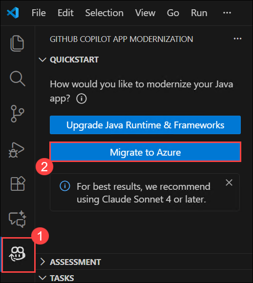

1. In the GitHub Copilot App Modernization lab, when the GitHub sign-in pop-up appears, click on **Allow**.

   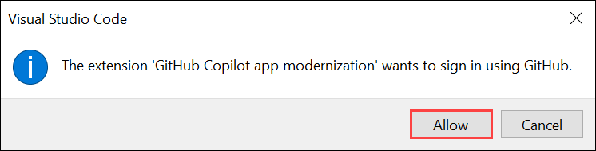

1. On the **Sign in to GitHub** tab, you will see the login screen. In that screen, enter the following **email: odl-user-<inject key="DeploymentID" enableCopy="false"/>_clabs**. Then click on **Sign in with your identity provider** **(2)**. 
   
   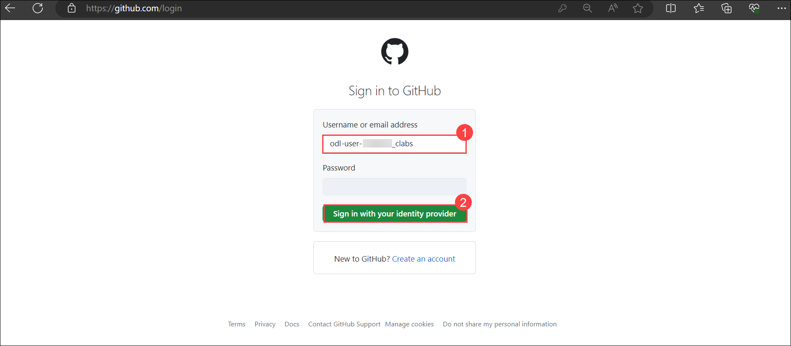
          
1. Next, On the **Single sign-on to CLoudLabs Organizations** select **Continue**.

   

1. On the **Pick an account** page, select **odl_User<inject key="DeploymentID" enableCopy="false"/>**.
   
    

1. On the “Select user to authorize Visual Studio Code” page, click on **Authorize Visual-Studio-Code**.

   

1. Navigate back to Visual Studio Code and wait for the assessment to complete and the report to be generated.

   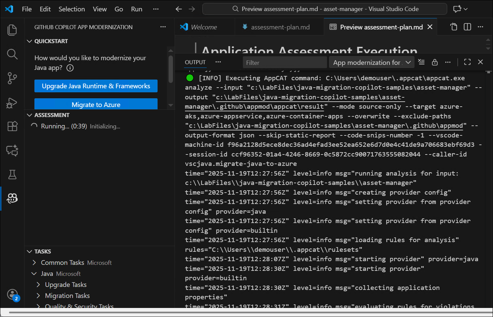

1. Review the **Assessment Report**. Select the **Issues** tab to view the proposed solutions for the issues identified in the report.

   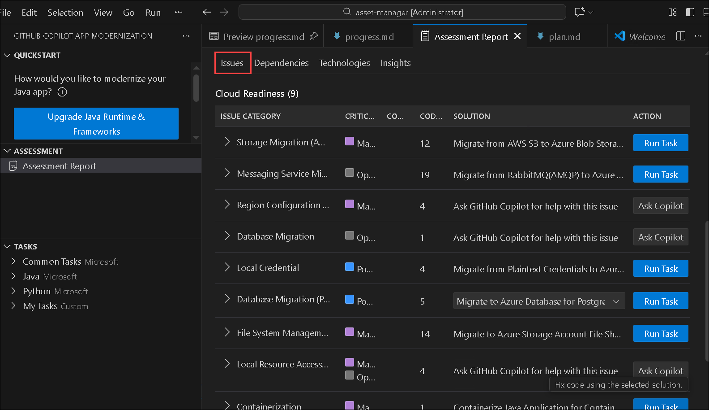

In this task, you have successfully analyzed the existing Java application using GitHub Copilot App Modernization to identify framework versions, code issues, migration blockers, and readiness for modernization and cloud migration.   

### Task 2: Upgrade Runtime and Frameworks

In this task, you will use predefined Copilot tasks to automatically upgrade the project’s Java runtime version and frameworks such as Spring/Spring Boot. Copilot will analyze the application, apply necessary version updates, recommend fixes, and commit changes in a new branch.

1. In the **Java Upgrade** table at the bottom of the **Issues** tab, click the **Run Task** button of the first entry **Java Version Upgrade**.

    

1. After clicking the **Run Task** button, the Copilot Chat panel will open with Agent Mode. The agent will check out a new branch and start upgrading the JDK version and Spring/Spring Boot framework. Click **Allow** for any requests from the agent.

   

In this task, you have successfully upgraded the Java runtime and Spring/Spring Boot frameworks using predefined Copilot tasks to ensure the application is secure, modern, and cloud-ready.   

### Task 3: Migrate to Azure Database for PostgreSQL Flexible Server using Predefined Tasks

In this task, you will migrate the application's database layer from the local PostgreSQL instance to Azure Database for PostgreSQL Flexible Server using a predefined migration task. Copilot will generate a migration plan, update configuration files, provision Azure resources, and apply the required code changes.

1. For this workshop, Click the **Run Task (3)** in the Assessment Report, on the right of the row `Data Migration (1)` - `Migrate to Azure Database for PostgreSQL (Spring) (2)`.

   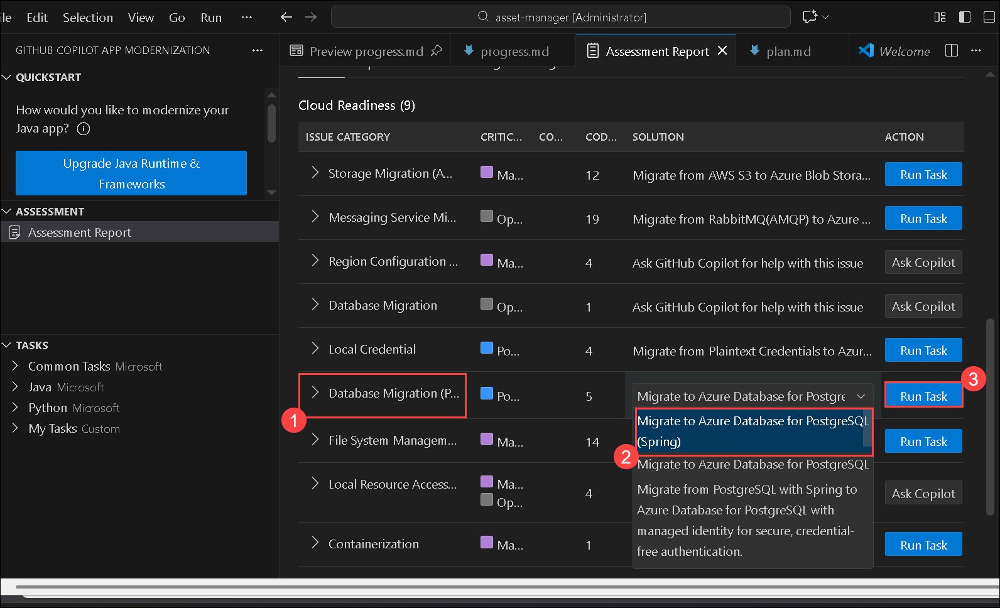

1. After clicking the **Run Task** button in the Assessment Report, the Copilot Chat panel will open with Agent Mode.

1. The Copilot Agent will first analyze the project and generate a migration plan.

1. After the plan is generated, Copilot Chat will stop with two generated files: **plan.md** and **progress.md**. If prompted, enter "Continue" or "Proceed" in the chat to confirm and execute the plan.

   

1. When the code is migrated, the extension will prepare the **CVE Validation and Fixing** process. Click **Allow** to proceed.

1. Review the proposed code changes and click **Keep** to apply them.

   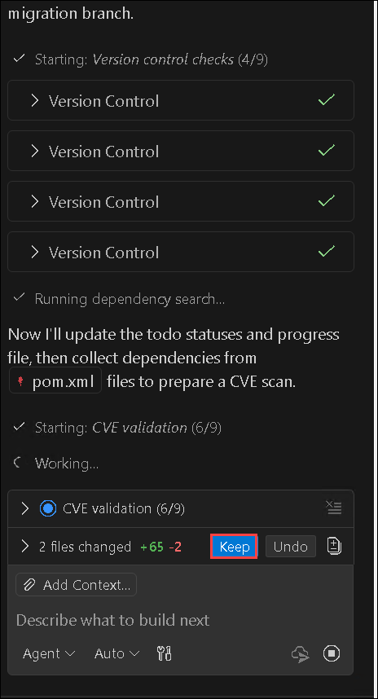

   >**Note:** When prompted, click **Continue**/**Allow** in chat notifications or type **y**/**yes** in terminal as Copilot Agent follows the plan and leverages agent tools to create and run provisioning and deployment scripts, fix potential errors, and finish the deployment. **DO NOT interrupt** when provisioning or deployment scripts are running.

In this task, you have migrated the application’s database from a local PostgreSQL instance to Azure Database for PostgreSQL Flexible Server by generating and executing an automated migration plan.

### Task 4: Migrate to Azure Blob Storage using Predefined Tasks

In this task, you will replace the application's dependency on AWS S3 with Azure Blob Storage. Using predefined tasks, Copilot will update the storage configuration, generate necessary migration scripts, provision blob storage resources, and apply all required code modifications.

1. Click the **Run Task** in the Assessment Report, on the right of the row `Storage Migration (AWS S3)` - `Migrate from AWS S3 to Azure Blob Storage`.
 
   

1. When prompted, click **Continue**/**Allow/Enable more AI features** in chat notifications or type **y**/**yes** in terminal as Copilot Agent follows the plan and leverages agent tools to create and run provisioning and deployment scripts, fix potential errors, and finish the deployment. **DO NOT interrupt** when provisioning or deployment scripts are running.

1. The following steps are the same as the above PostgreSQL server migration.

In this task, you have replaced AWS S3 with Azure Blob Storage by updating storage configurations, provisioning cloud resources, and applying the required application code changes.

### Task 5: Migrate to Azure Service Bus using Predefined Tasks

In this task, you will migrate the application's messaging component from RabbitMQ to Azure Service Bus. Copilot will generate a migration plan, update messaging libraries and configurations, provision Service Bus resources, and refactor the project to use Azure-native messaging services.

1. Click the **Run Task** in the Assessment Report, on the right of the row `Messaging Service Migration (Spring AMQP RabbitMQ)` - `Migrate from RabbitMQ(AMQP) to Azure Service Bus`.

   
   
1. When prompted, click **Continue**/**Allow** in chat notifications or type **y**/**yes** in terminal as Copilot Agent follows the plan and leverages agent tools to create and run provisioning and deployment scripts, fix potential errors, and finish the deployment. **DO NOT interrupt** when provisioning or deployment scripts are running.

1. The following steps are the same as the above PostgreSQL server migration.

   

In this task, you have migrated the messaging layer from RabbitMQ to Azure Service Bus by refactoring application messaging, updating configurations, and provisioning Azure messaging resources.   
   
### Task 6: Expose health endpoints using Custom Tasks

In this task, you will create a custom Copilot task to expose health endpoints using Spring Boot Actuator. You will define a task prompt, attach external documentation as reference, let Copilot generate the required changes, and apply the modifications to enable application health monitoring.

1. Open the sidebar of `GITHUB COPILOT APP MODERNIZATION`. Click the `+` button in the **Tasks** view to create a custom task.

   

1. In the opened tab, enter the **Task Name** and **Task Prompt** as shown below:

   - **Task Name (1)**: Expose health endpoint via Spring Boot Actuator
   - **Task Prompt (2)**: You are a Spring Boot developer assistant, follow the Spring Boot Actuator documentation to add basic health endpoints for Azure Container Apps deployment.

1. Click the **Add References (3)** button to add the Spring Boot Actuator official documentation as references.

   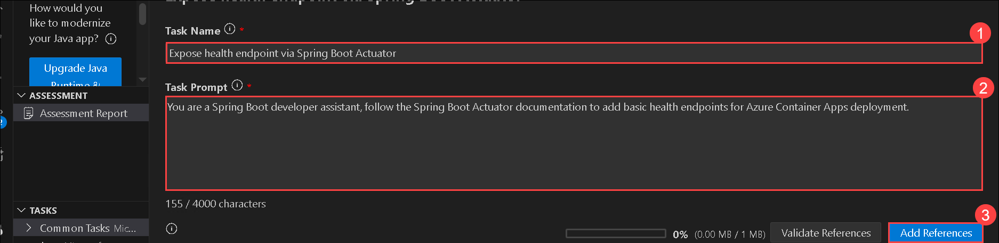
   
1. In the popped-up quick-pick window, select **External links**. 

   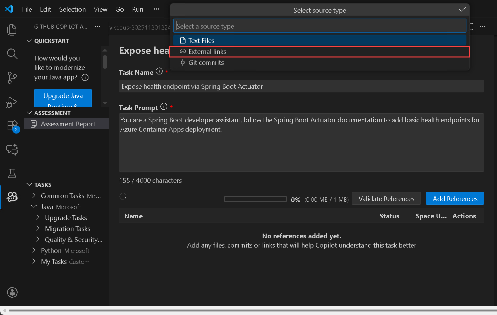

1. Then paste the following link: `https://docs.spring.io/spring-boot/reference/actuator/endpoints.html` **(1)** and click on **OK (2)**. 

   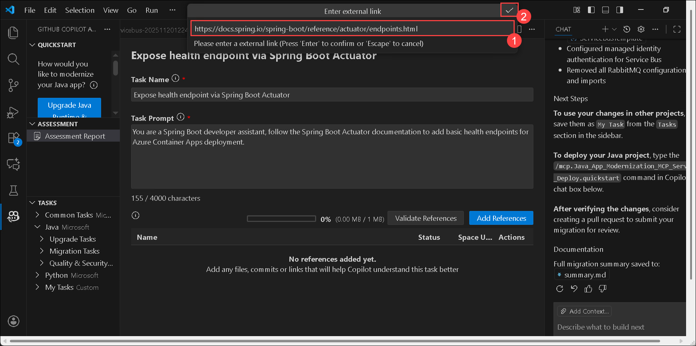
   
1. Click **Save** to create the task.

   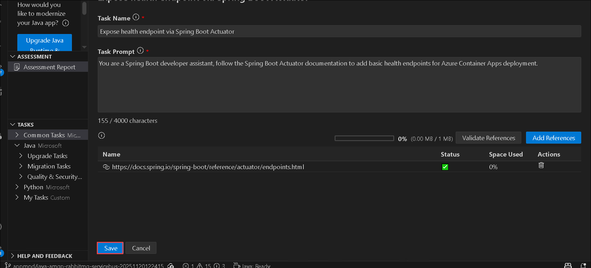

1. Click the **Run** button to trigger the custom task.

   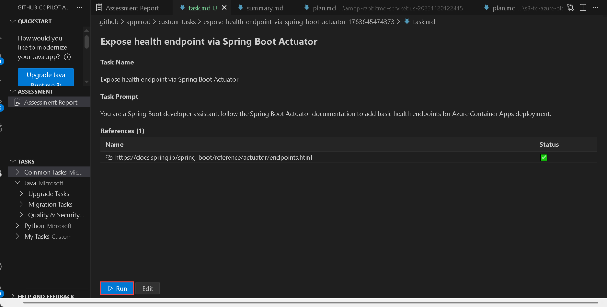

1. Follow the same steps as the predefined task to review and apply the changes.

1. Review the proposed code changes and click **Keep** to apply them.

In this task, you have created and executed a custom Copilot task to enable Spring Boot Actuator health endpoints for application monitoring and Azure readiness probes.

### Task 7: Containerize Applications

In this task, you will containerize the web and worker modules of the application using Containerization Tasks. Copilot will generate Dockerfiles, build container ../images, resolve build issues, and prepare the application for cloud deployment inside containers.

1. Open the sidebar of `GITHUB COPILOT APP MODERNIZATION`. In **Tasks** view, click the **Run Task** button of **Java** -> **Containerization Tasks** -> **Containerize Application**.
  
    

1. When prompted, click **Continue**/**Allow** in chat notifications or type **y**/**yes** in terminal as Copilot Agent follows the plan and leverages agent tools to create and run provisioning and deployment scripts, fix potential errors, and finish the deployment. **DO NOT interrupt** when provisioning or deployment scripts are running.

   > **Note**: If prompt to select az login then follow below steps: 

      1. Select **Work or school account** from the prompt and click on continue.

         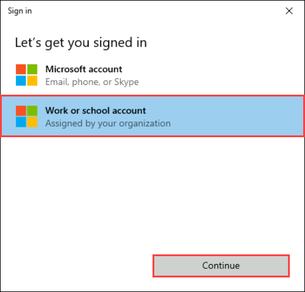

      1. You'll see the **Sign into Microsoft Azure** tab. Here, enter your credentials:
         
         - **Email/Username:** <inject key="AzureAdUserEmail"></inject>

            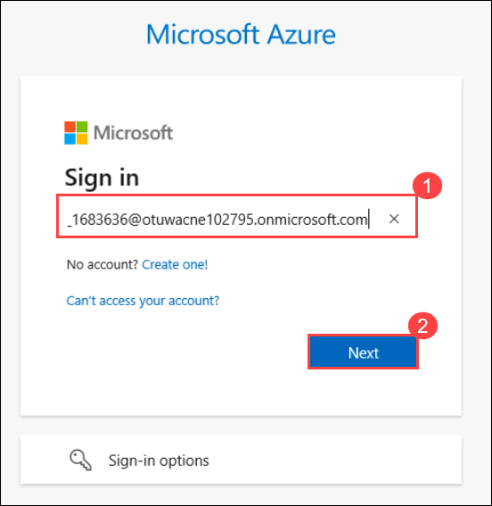

      1. Next, provide your password:

         - **Password:** <inject key="AzureAdUserPassword"></inject>

            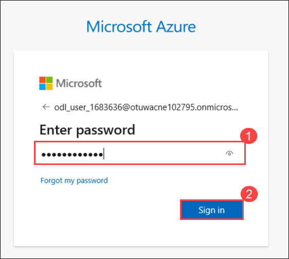

      1. When prompts, click on **No, sign in to this app only** and continue.

      1. Return to your **Visual Studio Code** terminal, now it prompts you to select subscription with a list of subscriptions, enter **1** and hit enter.

1. A predefined prompt will be populated in the Copilot Chat panel with Agent Mode. Copilot Agent will start to analyze the workspace and to create a **containerization-plan.copiotmd** with the containerization plan.

   

1. View the plan and collaborate with Copilot Agent as it follows the **Execution Steps** in the plan by clicking **Continue**/**Allow** in pop-up chat notifications to run commands. Some of the execution steps leverage agentic tools of **Container Assist**.
    
1. Copilot Agent will help generate Dockerfile, build Docker ../images and fix build errors if there are any. Click **Keep** to apply the generated code.

in this task, you have containerized the application components by generating Dockerfiles, building container ../images, and fixing build issues using Copilot’s containerization tasks.

### Task 8: Deploy to Azure

In this task, you will deploy the fully modernized and containerized application to Azure using a predefined deployment task. Copilot will generate a deployment plan, provision all required Azure resources, create deployment scripts, execute the deployment, and verify successful provisioning in the Azure portal.

1. Open the sidebar of `GITHUB COPILOT APP MODERNIZATION`. In **Tasks** view, click the **Run Task** button of **Common Tasks** -> **Deployment Tasks** -> **Provision Infrastructure and Deploy to Azure**.

    

1. Wait for the predefined deployment prompt to appear in the Copilot Chat panel with Agent Mode enabled. Click inside the prompt text in Copilot Chat. **Edit** the last sentence of the prompt to **Hosting service: AKS**.

   

1. Click **Continue**/**Allow** if pop-up notifications to let Copilot Agent analyze the project and create a deployment plan in **plan.copilotmd** with Azure resources architecture, recommended Azure resources for project and security configurations, and execution steps for deployment.

1. View the architecture diagram, resource configurations, and execution steps in the plan. Click **Keep** to save the plan and type in **Execute the plan** to start the deployment.

1. When prompted, click **Continue**/**Allow** in chat notifications or type **y**/**yes** in terminal as Copilot Agent follows the plan and leverages agent tools to create and run provisioning and deployment scripts, fix potential errors, and finish the deployment. You can also check the deployment status in **progress.copilotmd**. **DO NOT interrupt** when provisioning or deployment scripts are running.

1. Once deployment completed you can deployment status as below: 

   

    > **Note:** The response generated by the above prompt may vary. If your prompt returns an error, press **Ctrl + C** to copy the error and **Ctrl + V** to paste it in the Copilot chat and run. GitHub Copilot should automatically resolve the errors.

    >**Note:** If you face error: **Hmmm… can't reach this page**, terminate the chat and add the below given prompt.

    ```
    Migrate the PostgreSQL database to Azure Database for PostgreSQL Flexible Server, and deploy only the web application to Azure Kubernetes Service (AKS).
    ```
 
1. Navigate to Pods and check if they are in running state and try to access the External IP.

   >**Note:** If you encounter any errors copy those errors and paste in Copilot chat. GitHub Copilot should automatically resolve the errors.

1. In the Edge browser, navigate to the **Azure portal** and select **Resource Groups**.

   

2. On the **Resource Groups** page, select the newly created resource group.

   

3. You will now see that all the resources have been successfully deployed in the Azure portal.

   

In thistask, you have deployed the fully modernized and containerized application to Azure Kubernetes Service (AKS) by provisioning infrastructure, executing deployment scripts, and validating resources in the Azure portal.

## Summary

In this lab, you have completed the following:

- Assessed Your Java Application
- Upgraded Runtime and Frameworks
- Migrated to Azure Database for PostgreSQL Flexible Server using Predefined Tasks
- Migrated to Azure Blob Storage using Predefined Tasks
- Migrated to Azure Service Bus using Predefined Tasks
- Exposed health endpoints using Custom Tasks
- Containerized Applications
- Deployed to Azure

### You have successfully completed the lab!

In this lab, you used the **GitHub Copilot App Modernization** extension to assess, modernize, containerize, and deploy a Java application to Azure through a complete end-to-end modernization workflow. You evaluated the existing application, upgraded the Java runtime and frameworks, migrated the database to **Azure Database for PostgreSQL Flexible Server**, moved storage to **Azure Blob Storage**, transitioned messaging to **Azure Service Bus**, enabled **health monitoring with Spring Boot Actuator**, containerized the application using **Docker**, and successfully deployed it to **Azure Kubernetes Service (AKS)**. This lab demonstrated how GitHub Copilot accelerates Java application modernization and cloud migration with automation, intelligence, and minimal manual effort.
