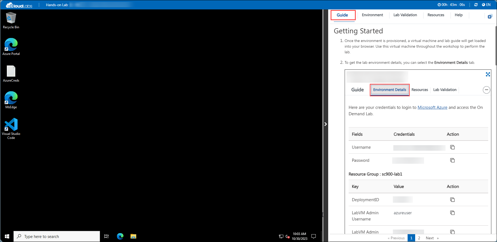
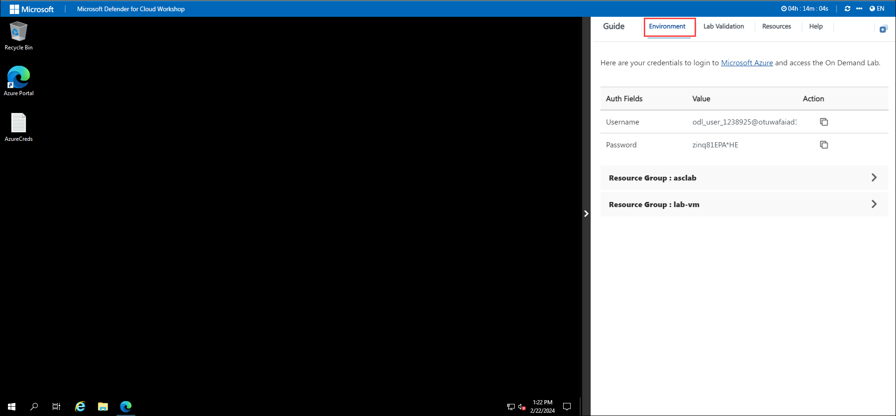
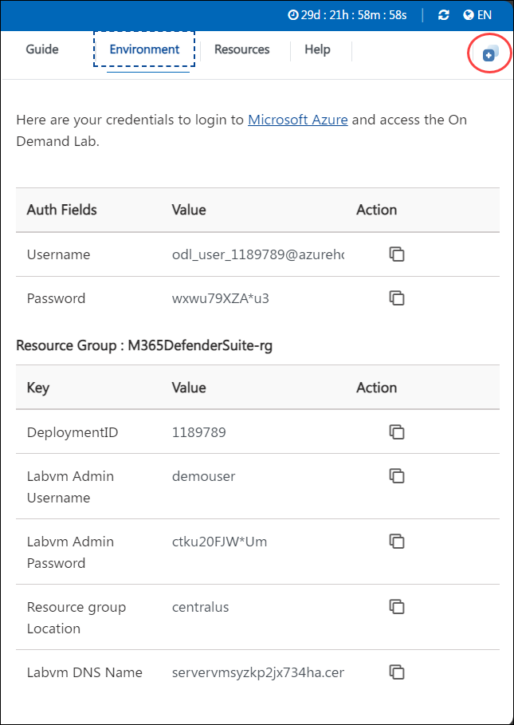
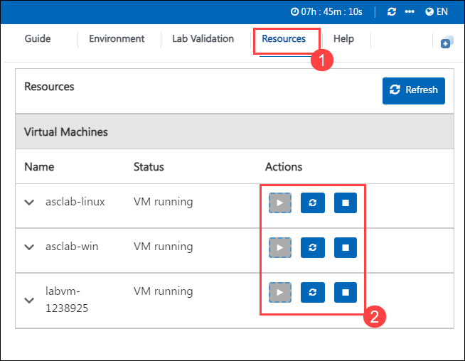
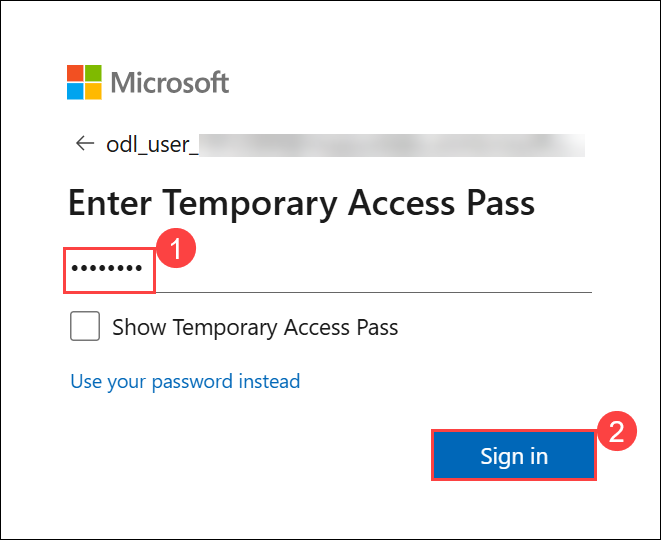

# Getting Started with Your GitHub CoPilot Java App Modernization Workshop
 
Welcome to your GitHub CoPilot Java App Modernization Workshop! We've prepared a seamless environment for you to explore and learn about integrating, transforming, and consolidating data from various structured, unstructured, and streaming data systems into a suitable schema for building analytics solutions. Let's begin by making the most of this experience:
 
## Accessing Your Lab Environment
 
Once you're ready to dive in, your virtual machine and lab guide will be right at your fingertips within your web browser.
 

### Virtual Machine & Lab Guide
 
Your virtual machine is your workhorse throughout the workshop. The lab guide is your roadmap to success.
 
## Exploring Your Lab Resources
 
To get a better understanding of your lab resources and credentials, navigate to the **Environment Details** tab.
 

 
## Utilizing the Split Window Feature
 
For convenience, you can open the lab guide in a separate window by selecting the **Split Window** button from the Top right corner.
 

 
## Managing Your Virtual Machine
 
Feel free to start, stop, or restart your virtual machine as needed from the **Resources** tab. Your experience is in your hands!
 

## Let's Get Started with Azure Portal
 
1. On your virtual machine, click on the Azure Portal icon as shown below:
 
   .png)

2. You'll see the **Sign into Microsoft Azure** tab. Here, enter your credentials:
 
   - **Email/Username:** <inject key="AzureAdUserEmail"></inject>
 
       
 
3. Next, enter Temporary Access Pass:
 
   - **Password:** <inject key="AzureAdUserPassword"></inject>
 
      
 
1. If prompted to stay signed in, you can click "No."
 
1. If a **Welcome to Microsoft Azure** pop-up window appears, simply click "Cancel" to skip the tour.

1. Click "Next" from the bottom right corner to embark on your Lab journey!
 
   .png)
 
Now you're all set to explore the powerful world of technology. Feel free to reach out if you have any questions along the way.

The CloudLabs support team is available 24/7, 365 days a year, via email and live chat to ensure seamless assistance at any time. We offer dedicated support channels tailored specifically for both learners and instructors, ensuring that all your needs are promptly and efficiently addressed.

Learner Support Contacts:

- Email Support: cloudlabs-support@spektrasystems.com
- Live Chat Support: https://cloudlabs.ai/labs-support

### Happy Learning!!