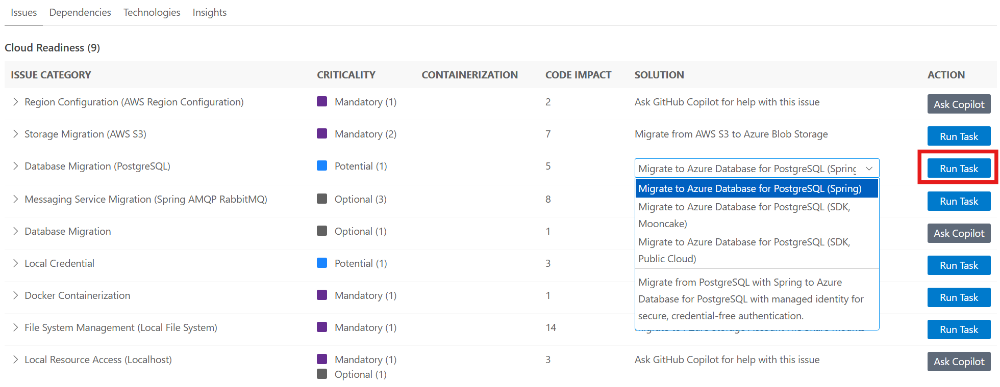
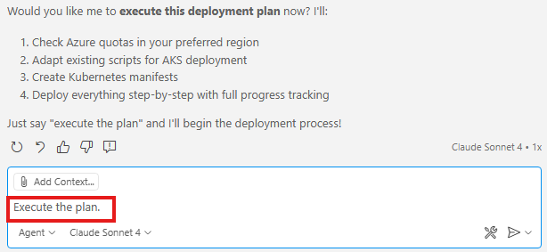

# GitHub CoPilot Java App Modernization

### Estimated Duration: 120 Minutes 

## Overview
In this lab, you will use the **GitHub Copilot app modernization** extension to assess, upgrade, migrate, and finally deploy the project to Azure.

## Lab Objectives

You will be able to complete the following tasks:
- Task 1: Assess Your Java Application
- Task 2: Upgrade Runtime and Frameworks
- Task 3: Migrate to Azure Database for PostgreSQL Flexible Server using Predefined Tasks
- Task 4: Migrate to Azure Blob Storage using Predefined Tasks
- Task 5: Migrate to Azure Service Bus using Predefined Tasks
- Task 6: Expose health endpoints using Custom Tasks
- Task 7: Containerize Applications
- Task 8: Deploy to Azure

### Task 1: Assess Your Java Application

The first step is to assess the sample Java application `asset-manager`. The assessment provides insights into the application's readiness for migration to Azure.

1. Double-click on the **Visual Studio Code** shortcut on the desktop of your virtual environment.

   

1. Click on **Explorer (1)** and select **Open Folder (2)** from the options.

   

1. From File Explorer, navigate to **C:\LabFiles\java-migration-copilot-samples (1)**, select the **asset-manager (2)** folder from the Quick Access section, and click on **Select Folder (3)**.

   

  > **Note:** If a pop-up comes for **Do you trust the authors of the files in this folder?**, select **Yes, I trust the authors**.

   
 
1. Open the **GitHub Copilot app modernization (1)** extension from the left panel. In the **QUICKSTART** view, click the **Migrate to Azure (2)** button to start the app assessment.

   

1. In the GitHub Copilot App Modernization lab, when the GitHub sign-in pop-up appears, click on **Allow**.

   

1. On the **Sign in to GitHub** tab, you will see the login screen. In that screen, enter the following **email: odl-user-<inject key="DeploymentID" enableCopy="false"/>_clabs**. Then click on **Sign in with your identity provider** **(2)**. 
   
   
          
1. Next, On the **Single sign-on to CLoudLabs Organizations** select **Continue**.

   

1. On the **Pick an account** page, select **odl_User<inject key="DeploymentID" enableCopy="false"/>**.
   
    

1. On the “Select user to authorize Visual Studio Code” page, click on **Authorize Visual-Studio-Code**.

   

1. Navigate back to Visual Studio Code and wait for the assessment to complete and the report to be generated.

   

1. Review the **Assessment Report**. Select the **Issues** tab to view the proposed solutions for the issues identified in the report.

### Task 2: Upgrade Runtime and Frameworks

1. In the **Java Upgrade** table at the bottom of the **Issues** tab, click the **Run Task** button of the first entry **Java Version Upgrade**.

    
1. After clicking the **Run Task** button, the Copilot Chat panel will open with Agent Mode. The agent will check out a new branch and start upgrading the JDK version and Spring/Spring Boot framework. Click **Allow** for any requests from the agent.

### Task 3: Migrate to Azure Database for PostgreSQL Flexible Server using Predefined Tasks

Then you can migrate the sample Java application `asset-manager` to Azure.

> Note: We've set up a [workshop/java-upgrade](https://github.com/Azure-Samples/java-migration-copilot-samples/tree/workshop/java-upgrade/asset-manager) branch where the Java upgrade has already been completed. Feel free to switch to this branch if you'd like to skip ahead and continue with the rest of the workshop.

1. For this workshop, select **Migrate to Azure Database for PostgreSQL (Spring)** in the Solution list, then click **Run Task**.

   

1. After clicking the **Run Task** button in the Assessment Report, the Copilot Chat panel will open with Agent Mode.
1. The Copilot Agent will first analyze the project and generate a migration plan.
1. After the plan is generated, Copilot Chat will stop with two generated files: **plan.md** and **progress.md**. If prompted, enter "Continue" or "Proceed" in the chat to confirm and execute the plan.
1. When the code is migrated, the extension will prepare the **CVE Validation and Fixing** process. Click **Allow** to proceed.
1. Review the proposed code changes and click **Keep** to apply them.

### Task 4: Migrate to Azure Blob Storage using Predefined Tasks

1. Click the **Run Task** in the Assessment Report, on the right of the row `Storage Migration (AWS S3)` - `Migrate from AWS S3 to Azure Blob Storage`.
1. The following steps are the same as the above PostgreSQL server migration.

### Task 5: Migrate to Azure Service Bus using Predefined Tasks

1. Click the **Run Task** in the Assessment Report, on the right of the row `Messaging Service Migration (Spring AMQP RabbitMQ)` - `Migrate from RabbitMQ(AMQP) to Azure Service Bus`.
1. The following steps are the same as the above PostgreSQL server migration.

### Task 6: Expose health endpoints using Custom Tasks

In this section, you will use custom tasks to expose health endpoints for your applications instead of writing code yourself. The following steps demonstrate how to generate custom tasks based on external web links and proper prompts.

> Note: Custom tasks are not supported for the IntelliJ IDEA plugin. If you are using IntelliJ IDEA, you can skip this section.

1. Open the sidebar of `GITHUB COPILOT APP MODERNIZATION`. Click the `+` button in the **Tasks** view to create a custom task.

   
1. In the opened tab, enter the **Task Name** and **Task Prompt** as shown below:
   - **Task Name**: Expose health endpoint via Spring Boot Actuator
   - **Task Prompt**: You are a Spring Boot developer assistant, follow the Spring Boot Actuator documentation to add basic health endpoints for Azure Container Apps deployment.
1. Click the **Add References** button to add the Spring Boot Actuator official documentation as references.

   
1. In the popped-up quick-pick window, select **External links**. Then paste the following link: `https://docs.spring.io/spring-boot/reference/actuator/endpoints.html`. Click **Save** to create the task.
1. Click the **Run** button to trigger the custom task.
1. Follow the same steps as the predefined task to review and apply the changes.
1. Review the proposed code changes and click **Keep** to apply them.

### Task 7: Containerize Applications

Now that you have successfully migrated your Java application to use Azure services, the next step is to prepare it for cloud deployment by containerizing both the web and worker modules. In this section, you will use **Containerization Tasks** to containerize your migrated applications.
> Note: If you encounter any issues with the previous migration step, you can directly proceed with the containerization step using the [workshop/expected](https://github.com/Azure-Samples/java-migration-copilot-samples/tree/workshop/expected/asset-manager) branch.

1. Open the sidebar of `GITHUB COPILOT APP MODERNIZATION`. In **Tasks** view, click the **Run Task** button of **Java** -> **Containerization Tasks** -> **Containerize Application**.
  
    

1. A predefined prompt will be populated in the Copilot Chat panel with Agent Mode. Copilot Agent will start to analyze the workspace and to create a **containerization-plan.copiotmd** with the containerization plan.

    
1. View the plan and collaborate with Copilot Agent as it follows the **Execution Steps** in the plan by clicking **Continue**/**Allow** in pop-up chat notifications to run commands. Some of the execution steps leverage agentic tools of **Container Assist**.

    <!--  -->
1. Copilot Agent will help generate Dockerfile, build Docker images and fix build errors if there are any. Click **Keep** to apply the generated code.

### Task 8: Deploy to Azure

At this point, you have successfully migrated the sample Java application `asset-manager` to Azure Database for PostgreSQL (Spring), Azure Blob Storage, and Azure Service Bus, and exposed health endpoints via Spring Boot Actuator. Now, you can start the deployment to Azure.
> Note: If you encounter any issues with the previous migration step, you can directly proceed with the deployment step using the [workshop/expected](https://github.com/Azure-Samples/java-migration-copilot-samples/tree/workshop/expected/asset-manager) branch.

1. Open the sidebar of `GITHUB COPILOT APP MODERNIZATION`. In **Tasks** view, click the **Run Task** button of **Java** -> **Deployment Tasks** -> **Provision Infrastructure and Deploy to Azure**.

    
1. A predefined prompt will be populated in the Copilot Chat panel with Agent Mode. The default hosting Azure service is Azure Container Apps.To change the hosting service to **Azure Kubernetes Service** (AKS), click on the prompt in the Copilot Chat panel and edit the last sentence of the prompt to **Hosting service: AKS**.

    
1. Click ****Continue**/**Allow** if pop-up notifications to let Copilot Agent analyze the project and create a deployment plan in **plan.copilotmd** with Azure resources architecture, recommended Azure resources for project and security configurations, and execution steps for deployment.

1. View the architecture diagram, resource configurations, and execution steps in the plan. Click **Keep** to save the plan and type in **Execute the plan** to start the deployment.

    
1. When prompted, click **Continue**/**Allow** in chat notifications or type **y**/**yes** in terminal as Copilot Agent follows the plan and leverages agent tools to create and run provisioning and deployment scripts, fix potential errors, and finish the deployment. You can also check the deployment status in **progress.copilotmd**. **DO NOT interrupt** when provisioning or deployment scripts are running.

    

> Note: If you encounter any issues with the deployment step, you can refer to the expected Copilot-generated deployment scripts in `/.azure` folder of the [workshop/deployment-expected](https://github.com/Azure-Samples/java-migration-copilot-samples/tree/workshop/deployment-expected/asset-manager) branch to compare your deployment scripts and troubleshoot the problems.

## Summary

In this lab, you have completed the following:

- Assessed Your Java Application
- Upgraded Runtime and Frameworks
- Migrated to Azure Database for PostgreSQL Flexible Server using Predefined Tasks
- Migrated to Azure Blob Storage using Predefined Tasks
- Migrated to Azure Service Bus using Predefined Tasks
- Exposed health endpoints using Custom Tasks
- Containerized Applications
- Deployed to Azure

### You have successfully completed the lab.

